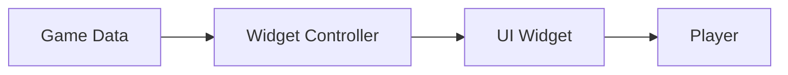
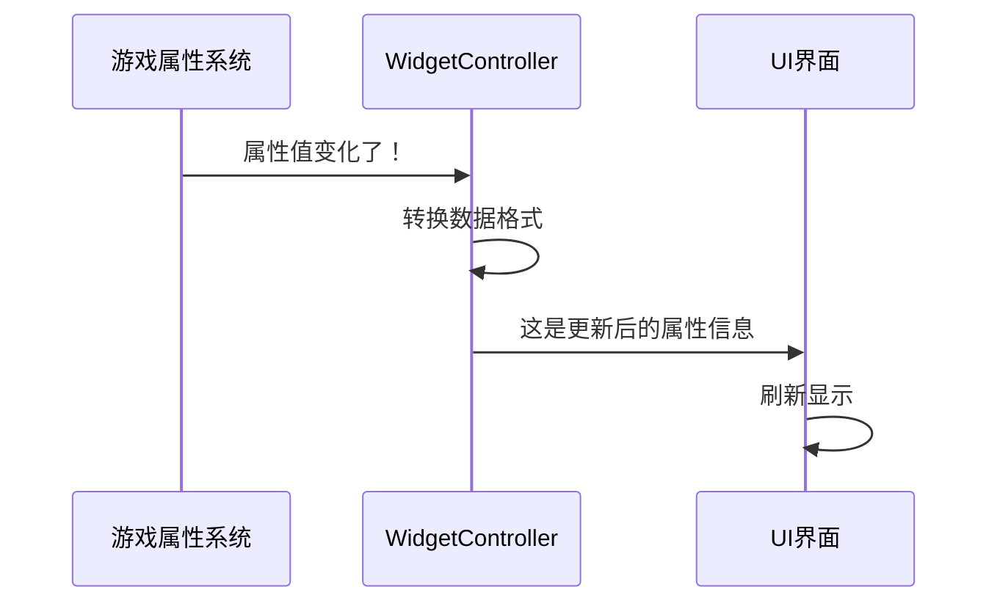
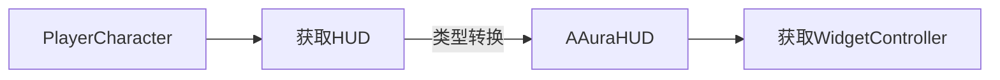

## 从零理解 Widget Controller

### 1. Widget Controller 是什么？

想象Widget Controller就像是一个"翻译官"，它负责：

1. 监听游戏数据的变化（比如角色属性）
2. 把游戏数据"翻译"成UI能理解的语言
3. 告诉UI什么时候需要更新


### 2. 基础概念分解

#### 2.1 核心组成部分



### 2.2 你代码中的关键部分解释

```cpp

// 这是一个委托（可以理解为"广播喇叭"）
UPROPERTY(BlueprintAssignable)
FAttributeInfoSignature AttributeInfoDelegate; 
// 当属性变化时，通过这个"喇叭"通知UI
```

### 3. 从零开始的完整示例


#### 3.1 步骤1：创建基础Widget Controller

```cpp
// 最简单的Widget Controller基类
UCLASS()
class UAuraWidgetController : public UObject
{
    GENERATED_BODY()
    
public:
    // 初始化函数
    void Initialize(UAbilitySystemComponent* ASC, UAttributeSet* AS)
    {
        AbilitySystemComponent = ASC;
        AttributeSet = AS;
    }
    
protected:
    UPROPERTY()
    UAbilitySystemComponent* AbilitySystemComponent;
    
    UPROPERTY()
    UAttributeSet* AttributeSet;
};
```

#### 3.2 步骤2：创建属性菜单Controller（简化版）

```cpp
UCLASS()
class USimpleAttributeController : public UAuraWidgetController
{
    GENERATED_BODY()
    
public:
    // 绑定属性变化监听
    void BindCallbacks()
    {
        // 监听生命值变化
        AbilitySystemComponent->GetGameplayAttributeValueChangeDelegate(
            UAttributeSet::GetHealthAttribute()).AddUObject(
                this, &USimpleAttributeController::HealthChanged);
    }
    
    // 广播初始值
    void BroadcastInitialValues()
    {
        float CurrentHealth = AttributeSet->GetHealth();
        OnHealthChanged.Broadcast(CurrentHealth);
    }
    
    // 可绑定到UI的委托
    UPROPERTY(BlueprintAssignable)
    FOnFloatValueChanged OnHealthChanged;
    
private:
    void HealthChanged(const FOnAttributeChangeData& Data)
    {
        OnHealthChanged.Broadcast(Data.NewValue);
    }
};
```

#### 3.3 步骤3：在UI Widget中使用

```cpp
UCLASS()
class UHealthWidget : public UUserWidget
{
    GENERATED_BODY()
    
public:
    void SetupController(UAbilitySystemComponent* ASC, UAttributeSet* AS)
    {
        Controller = NewObject<USimpleAttributeController>(this);
        Controller->Initialize(ASC, AS);
        Controller->BindCallbacks();
        Controller->BroadcastInitialValues();
        
        // 绑定更新事件
        Controller->OnHealthChanged.AddUObject(this, &UHealthWidget::UpdateHealthBar);
    }
    
    UFUNCTION()
    void UpdateHealthBar(float NewHealth)
    {
        HealthProgressBar->SetPercent(NewHealth / MaxHealth);
    }
    
private:
    UPROPERTY()
    USimpleAttributeController* Controller;
    
    UPROPERTY(meta=(BindWidget))
    UProgressBar* HealthProgressBar;
};
```

### 4. 原代码解析（AttributeMenuWidgetController）

#### 4.1 工作流程




#### 4.2 关键方法解释

```cpp
// 为每个属性绑定监听器
AbilitySystemComponent->GetGameplayAttributeValueChangeDelegate(Pair.Value())
    .AddLambda([this, Pair](const FOnAttributeChangeData& Data)
    {
        // 当属性变化时调用这个lambda
        BroadcastAttributeInfo(Pair.Key, Pair.Value());
    });

```

BroadcastAttributeInfo():

```cpp
// 准备UI需要的数据并广播
FAuraAttributeInfo Info = AttributeInfo->FindAttributeInfoForTag(AttributeTag);
Info.AttributeValue = Attribute.GetNumericValue(AttributeSet);
AttributeInfoDelegate.Broadcast(Info); // "大喊"让UI更新
```

### 5. 新手常见问题解答

Q1: 为什么需要WidgetController？不能直接在Widget里监听属性吗？

A1: 可以但不好，因为：

1. 会使UI代码混乱
2. 难以复用逻辑
3. 多人游戏同步困难

Q2: 委托(Delegate)是什么？

A2: 想象成"对讲机"：

1. WidgetController拿着发送端
2. UI Widget拿着接收端
3. 当数据变化时"喊话"

Q3: 如何在实际游戏中使用？

A3: 典型流程：

1. 创建Widget时实例化Controller
2. 在Widget初始化时绑定Controller
3. Controller自动处理后续更新

### 6. 可视化比喻理解

把整个系统想象成点餐系统：

​厨房(Game Data): 准备食物（游戏数据）

​服务员(WidgetController):

监听厨房状态

把订单翻译成厨师能懂的语言

通知顾客餐点状态

​顾客(UI Widget):

显示餐点状态

通过服务员下单

## 在 Player Character 中调用 HUD 中的 Widget Controller

在您的Aura项目中，Widget Controller被放置在HUD中，这是一种常见的架构设计。要从Player Character访问这些Controller，您需要通过正确的引用链来获取。以下是完整的实现方法：

### 1. 基本获取流程



### 2. 具体实现步骤

#### 2.1 在PlayerCharacter中添加获取方法

```cpp
// 在AuraCharacter.h中添加
UCLASS()
class AAuraCharacter : public ACharacter
{
    // ...其他代码...
    
public:
    UFUNCTION(BlueprintCallable, Category = "UI")
    UOverlayWidgetController* GetOverlayWidgetController();
    
    UFUNCTION(BlueprintCallable, Category = "UI")
    UAttributeMenuWidgetController* GetAttributeMenuWidgetController();
    
    UFUNCTION(BlueprintCallable, Category = "UI")
    USpellMenuWidgetController* GetSpellMenuWidgetController();
    
private:
    FWidgetControllerParams GetWidgetControllerParams();
};
```

#### 2.2 在PlayerCharacter.cpp中实现


```cpp
FWidgetControllerParams AAuraCharacter::GetWidgetControllerParams()
{
    FWidgetControllerParams Params;
    Params.PlayerController = Cast<APlayerController>(GetController());
    Params.PlayerState = GetPlayerState();
    Params.AbilitySystemComponent = GetAbilitySystemComponent(); // 假设您有这个方法
    Params.AttributeSet = GetAttributeSet(); // 假设您有这个方法
    return Params;
}

UOverlayWidgetController* AAuraCharacter::GetOverlayWidgetController()
{
    if (AAuraHUD* AuraHUD = Cast<AAuraHUD>(GetHUD()))
    {
        return AuraHUD->GetOverlayWidgetController(GetWidgetControllerParams());
    }
    return nullptr;
}

UAttributeMenuWidgetController* AAuraCharacter::GetAttributeMenuWidgetController()
{
    if (AAuraHUD* AuraHUD = Cast<AAuraHUD>(GetHUD()))
    {
        return AuraHUD->GetAttributeMenuWidgetController(GetWidgetControllerParams());
    }
    return nullptr;
}

USpellMenuWidgetController* AAuraCharacter::GetSpellMenuWidgetController()
{
    if (AAuraHUD* AuraHUD = Cast<AAuraHUD>(GetHUD()))
    {
        return AuraHUD->GetSpellMenuWidgetController(GetWidgetControllerParams());
    }
    return nullptr;
}
```

### 3. 使用示例

#### 3.1 在Character代码中调用

```cpp
void AAuraCharacter::OpenAttributeMenu()
{
    if (UAttributeMenuWidgetController* AttributeController = GetAttributeMenuWidgetController())
    {
        AttributeController->BroadcastInitialValues();
        // 其他操作...
    }
}
```

### 4. 注意事项


1. 初始化顺序：

确保HUD在Character尝试获取Controller之前已经初始化

可以在BeginPlay中检查：

```cpp
void AAuraCharacter::BeginPlay()
{
    Super::BeginPlay();
    
    if (!GetHUD())
    {
        FTimerHandle Timer;
        GetWorld()->GetTimerManager().SetTimer(Timer, [this]()
        {
            if (GetHUD()) 
            {
                // HUD已就绪
            }
        }, 0.1f, false);
    }
}
```

2. ​多人游戏支持：

使用IsLocallyControlled()检查本地玩家

网络复制关键UI数据：

```cpp
void AAuraCharacter::GetLifetimeReplicatedProps(TArray<FLifetimeProperty>& OutLifetimeProps) const
{
    Super::GetLifetimeReplicatedProps(OutLifetimeProps);
    
    DOREPLIFETIME(AAuraCharacter, SomeUIParameter);
}
```

3. ​空指针保护：

```cpp
if (AAuraHUD* AuraHUD = Cast<AAuraHUD>(GetHUD()))
{
    if (UOverlayWidgetController* Controller = AuraHUD->GetOverlayWidgetController(Params))
    {
        // 安全使用Controller
    }
}
```