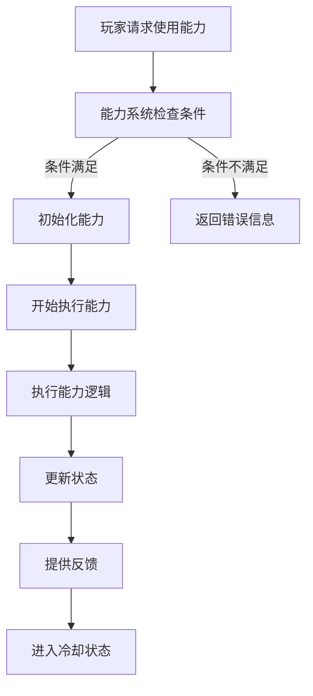
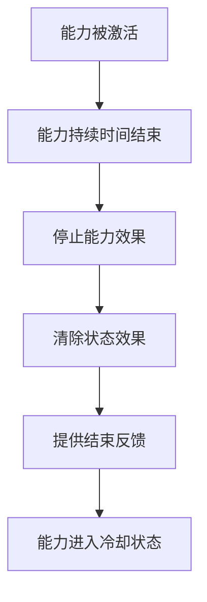

## GAS 介绍

*官方解释*

首先什么是Gameplay Ability System ? Unreal 官方的解释是什么？

:::info

Gameplay Ability System (GAS) 是 Unreal Engine 提供的一个强大框架，用于管理游戏中的能力和状态。它允许开发者创建复杂的角色能力、状态效果和技能系统，适用于各种类型的游戏，尤其是角色扮演游戏和动作游戏。

:::

## 关键特性包括

根据 Unreal Engine 的官方文档，Gameplay Ability System 的关键特性包括：

### 1. 能力管理：

GAS 允许开发者定义和管理角色的能力（如技能、法术等），并支持复杂的能力逻辑。

### 2. 状态效果：

可以创建各种状态效果（如增益、减益、持续伤害等），这些效果可以应用于角色或其他游戏对象。

### 3. 网络同步：

GAS 原生支持网络同步，确保在多人游戏中，所有玩家都能看到相同的能力效果和状态变化。

### 4. 可扩展性：

系统设计为高度可扩展，开发者可以根据需要添加自定义功能和逻辑。

### 5. 数据驱动：

能力和状态效果可以通过数据表进行配置，使得设计和调整更为灵活。

## 它的主要组件包括：

1. **Abilities**：角色可以执行的技能或行为。
2. **Attributes**：角色的基本属性，如生命值、法力值等。
3. **Effects**：对角色或环境产生影响的状态效果。

### 1. 激活图示

### 2. 释放图示

