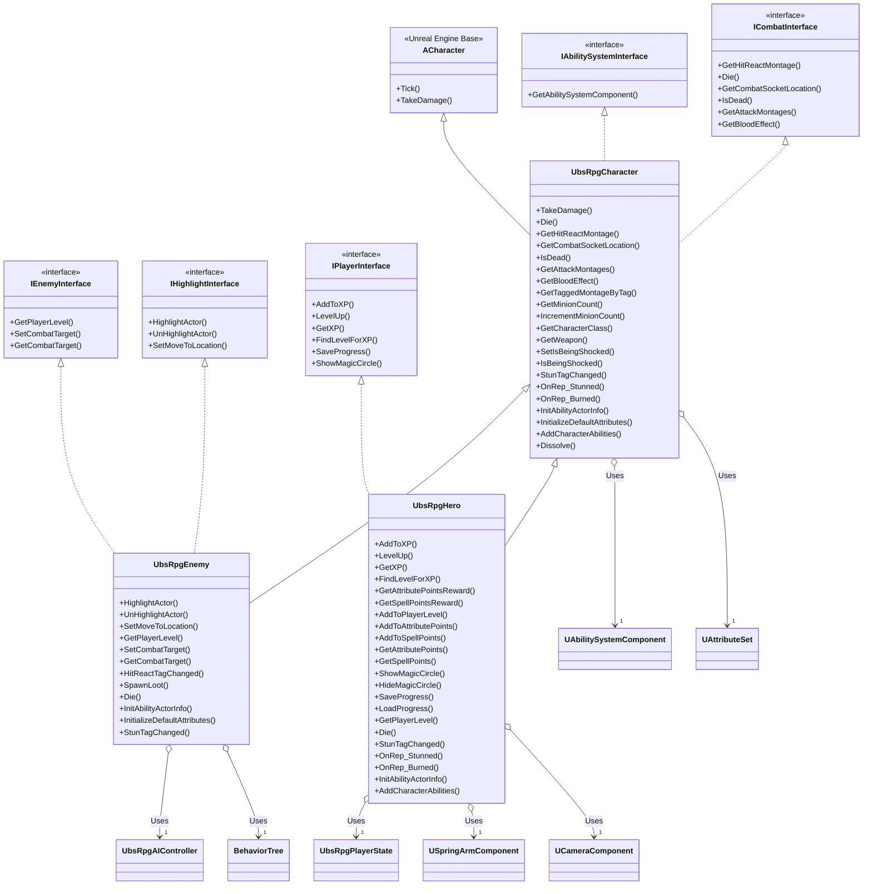

# RPG 功能解释

以下是对 `UbsRpgCharacter`、`UbsRpgEnemy` 和 `UbsRpgHero` 类中主要功能的解释，涵盖其作用和在 RPG 游戏中的应用场景。

## 1. 总体概述
这些类构成了一个基于 Unreal Engine 的 RPG 角色系统框架，支持玩家和敌人的战斗、状态管理、技能系统和进度保存。功能分为通用角色逻辑（`UbsRpgCharacter`）、敌人专属逻辑（`UbsRpgEnemy`）和玩家专属逻辑（`UbsRpgHero`）。

## 2. 功能分类与说明

| **功能/特性** | **所属类** | **用途** |
| --- | --- | --- |
| `TakeDamage` | `UbsRpgCharacter` | 处理角色受到的伤害，并广播伤害事件以触发相关逻辑。 |
| `Die` | `UbsRpgCharacter`, `UbsRpgEnemy`, `UbsRpgHero` | 管理角色死亡，包括物理模拟、溶解效果和死亡事件广播。`UbsRpgEnemy` 生成掉落物，`UbsRpgHero` 触发游戏模式处理。 |
| `GetHitReactMontage` | `UbsRpgCharacter` | 返回受击时的动画蒙太奇，用于表现受击反应。 |
| `GetCombatSocketLocation` | `UbsRpgCharacter` | 获取战斗中使用的插槽位置（如武器尖端、手部），用于动画或特效。 |
| `IsDead` | `UbsRpgCharacter` | 检查角色是否已死亡。 |
| `GetAttackMontages` | `UbsRpgCharacter` | 返回攻击动画蒙太奇列表，用于战斗动画。 |
| `GetBloodEffect` | `UbsRpgCharacter` | 获取血液效果的 Niagara 系统，用于视觉表现。 |
| `GetTaggedMontageByTag` | `UbsRpgCharacter` | 根据标签获取特定攻击蒙太奇，用于精准控制动画。 |
| `GetMinionCount` / `IncrementMinionCount` | `UbsRpgCharacter` | 跟踪并更新召唤的随从数量。 |
| `GetCharacterClass` | `UbsRpgCharacter` | 返回角色职业（如战士、元素使）。 |
| `GetWeapon` | `UbsRpgCharacter` | 返回武器的骨骼网格组件。 |
| `SetIsBeingShocked` / `IsBeingShocked` | `UbsRpgCharacter` | 管理电击状态，影响角色行为。 |
| `StunTagChanged` | `UbsRpgCharacter`, `UbsRpgEnemy`, `UbsRpgHero` | 处理眩晕减益效果，禁用移动并应用视觉效果。`UbsRpgEnemy` 更新 AI 行为，`UbsRpgHero` 阻止玩家输入。 |
| `OnRep_Stunned` / `OnRep_Burned` | `UbsRpgCharacter`, `UbsRpgHero` | 同步眩晕和燃烧状态，激活/禁用减益视觉效果。`UbsRpgHero` 额外管理输入阻止。 |
| `InitAbilityActorInfo` | `UbsRpgCharacter`, `UbsRpgEnemy`, `UbsRpgHero` | 初始化能力系统组件，用于支持游戏技能。`UbsRpgEnemy` 配置 AI，`UbsRpgHero` 集成玩家状态。 |
| `InitializeDefaultAttributes` | `UbsRpgCharacter`, `UbsRpgEnemy` | 应用默认的游戏效果（如属性、生命值等）。 |
| `AddCharacterAbilities` | `UbsRpgCharacter`, `UbsRpgHero` | 为角色添加初始和被动技能。`UbsRpgHero` 支持从存档加载技能。 |
| `Dissolve` | `UbsRpgCharacter` | 在角色死亡时触发溶解视觉效果，应用于角色和武器。 |
| `HighlightActor` / `UnHighlightActor` | `UbsRpgEnemy` | 切换高亮效果，用于 UI 反馈（如选中敌人）。 |
| `SetMoveToLocation` | `UbsRpgEnemy` | 设置 AI 移动目标的占位功能（未实现）。 |
| `GetPlayerLevel` | `UbsRpgEnemy`, `UbsRpgHero` | 返回敌人或玩家的等级。 |
| `SetCombatTarget` / `GetCombatTarget` | `UbsRpgEnemy` | 管理敌人的战斗目标，驱动 AI 行为。 |
| `HitReactTagChanged` | `UbsRpgEnemy` | 处理受击反应状态，暂停移动并更新 AI 黑板。 |
| `SpawnLoot` | `UbsRpgEnemy` | 敌人死亡时触发掉落物生成（蓝图实现）。 |
| `AddToXP` / `GetXP` | `UbsRpgHero` | 管理玩家经验值，更新玩家状态。 |
| `LevelUp` / `MulticastLevelUpParticles` | `UbsRpgHero` | 处理玩家升级，触发 Niagara 粒子效果。 |
| `FindLevelForXP` | `UbsRpgHero` | 根据经验值计算玩家等级。 |
| `GetAttributePointsReward` / `GetSpellPointsReward` | `UbsRpgHero` | 返回指定等级的属性点或技能点奖励。 |
| `AddToPlayerLevel` | `UbsRpgHero` | 提升玩家等级并更新技能状态。 |
| `AddToAttributePoints` / `AddToSpellPoints` | `UbsRpgHero` | 为玩家增加属性点或技能点。 |
| `GetAttributePoints` / `GetSpellPoints` | `UbsRpgHero` | 获取当前的属性点或技能点。 |
| `ShowMagicCircle` / `HideMagicCircle` | `UbsRpgHero` | 切换魔法圈贴图和鼠标光标可见性，用于施法 UI。 |
| `SaveProgress` | `UbsRpgHero` | 保存玩家进度（等级、经验、属性、技能）到检查点。 |
| `LoadProgress` | `UbsRpgHero` | 加载保存的玩家进度，初始化属性和技能。 |

### 2.1 通用角色功能（UbsRpgCharacter）
- **核心战斗**：
  - `TakeDamage`：处理伤害计算并广播事件，触发 UI 或其他系统更新。
  - `Die`：管理死亡流程，包括物理模拟、溶解效果和事件通知。
  - `GetHitReactMontage` / `GetAttackMontages` / `GetTaggedMontageByTag`：提供战斗动画支持，确保攻击和受击表现流畅。
  - `GetCombatSocketLocation`：定位武器或手部插槽，用于特效或命中检测。
  - `GetBloodEffect`：返回血液粒子效果，增强视觉反馈。
- **状态管理**：
  - `IsDead`：判断角色是否死亡，用于逻辑控制。
  - `SetIsBeingShocked` / `IsBeingShocked`：管理电击状态，影响移动或动画。
  - `StunTagChanged`：处理眩晕效果，暂停移动并显示 Niagara 粒子。
  - `OnRep_Stunned` / `OnRep_Burned`：同步眩晕和燃烧状态，确保多人游戏一致性。
- **能力系统**：
  - `InitAbilityActorInfo`：初始化技能系统，支持技能和属性管理。
  - `InitializeDefaultAttributes`：设置默认属性（如生命、力量）。
  - `AddCharacterAbilities`：添加主动和被动技能。
- **其他**：
  - `GetMinionCount` / `IncrementMinionCount`：管理召唤随从数量。
  - `GetCharacterClass`：返回角色职业，影响技能和属性。
  - `GetWeapon`：提供武器网格，用于渲染或交互。
  - `Dissolve`：触发死亡时的溶解效果，提升视觉体验。

### 2.2 敌人专属功能（UbsRpgEnemy）
- **AI 与交互**：
  - `HighlightActor` / `UnHighlightActor`：切换高亮效果，用于玩家选中敌人时的 UI 反馈。
  - `SetCombatTarget` / `GetCombatTarget`：管理 AI 战斗目标，驱动攻击行为。
  - `SetMoveToLocation`：占位功能，预留 AI 移动逻辑。
  - `HitReactTagChanged`：处理受击反应，暂停移动并更新 AI 黑板。
- **敌人属性**：
  - `GetPlayerLevel`：返回敌人等级，用于平衡战斗难度。
  - `InitializeDefaultAttributes`：根据等级和职业初始化敌人属性。
- **死亡与掉落**：
  - `Die`：扩展死亡逻辑，生成掉落物并设置生命周期。
  - `SpawnLoot`：触发蓝图实现的掉落物生成。
- **能力与状态**：
  - `InitAbilityActorInfo`：为敌人配置技能系统，集成 AI 控制器。
  - `StunTagChanged`：更新 AI 黑板，反映眩晕状态。

### 2.3 玩家专属功能（UbsRpgHero）
- **经验与升级**：
  - `AddToXP` / `GetXP`：管理经验值，驱动升级系统。
  - `LevelUp` / `MulticastLevelUpParticles`：处理升级，触发粒子效果。
  - `FindLevelForXP`：根据经验值计算等级。
  - `GetAttributePointsReward` / `GetSpellPointsReward`：提供升级奖励点数。
  - `AddToPlayerLevel` / `AddToAttributePoints` / `AddToSpellPoints`：更新玩家等级和点数。
  - `GetAttributePoints` / `GetSpellPoints`：获取当前点数。
- **交互与 UI**：
  - `ShowMagicCircle` / `HideMagicCircle`：切换魔法圈和鼠标光标，用于施法交互。
- **存档与加载**：
  - `SaveProgress`：保存玩家进度（等级、技能、属性等）。
  - `LoadProgress`：加载存档，恢复玩家状态。
- **战斗与状态**：
  - `Die`：触发游戏模式处理玩家死亡（如重生）。
  - `GetPlayerLevel`：返回玩家等级。
  - `StunTagChanged` / `OnRep_Stunned` / `OnRep_Burned`：管理眩晕和燃烧，阻止输入并更新 UI。
- **能力系统**：
  - `InitAbilityActorInfo`：集成玩家状态，初始化技能系统。
  - `AddCharacterAbilities`：支持从存档加载技能。

## 3. 总结
- `UbsRpgCharacter` 提供通用的 RPG 角色基础，包括战斗、状态和技能系统。
- `UbsRpgEnemy` 扩展为敌人，增加 AI、掉落和高亮功能。
- `UbsRpgHero` 专注于玩家体验，支持经验、升级、存档和交互。
这些功能共同支持一个完整的 RPG 游戏框架，涵盖战斗、进度管理和视觉表现。

