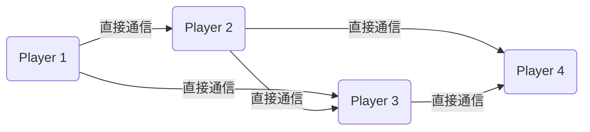
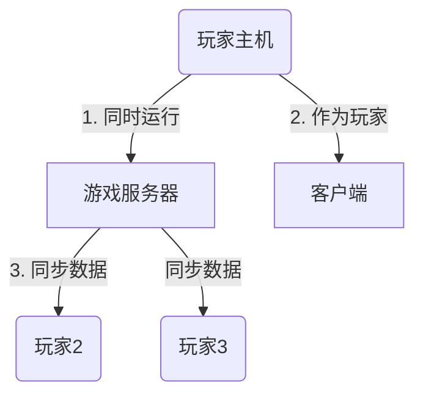
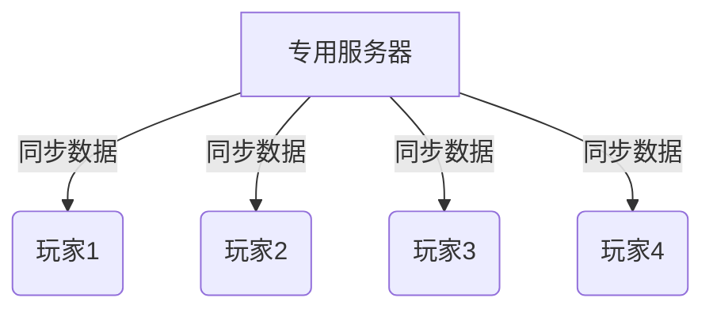

## 多人联网游戏概念

相对单机游戏，多人联网游戏需要玩家同步与其他玩家之间的数据。多人联网可以分为一下几个模式

| 模式                | 架构特点           | 成本   | 延迟   | 扩展性 | 数据一致性 | 防作弊能力 | 适用场景               |
|---------------------|--------------------|--------|--------|--------|------------|------------|------------------------|
| ​**Peer-to-Peer**​    | 全分布式对等连接   | 🟢 低  | 🟢 低  | 🔴 差  | 🔴 弱      | 🔴 弱      | 局域网/小规模实时对战  |
| ​**Listen Server**​   | 客户端托管服务器   | 🟢 低  | 🟡 中  | 🟡 中  | 🟡 中      | 🟡 中      | 中小型合作游戏         |
| ​**Dedicated Server**| 集中式权威服务器   | 🔴 高  | 🟡 中  | 🟢 优  | 🟢 强      | 🟢 强      | 大型多人在线游戏       |
| ​**Hybrid**​          | 混合架构           | 🟡 中  | 🟢 低  | 🟡 良  | 🟡 中      | 🟡 中      | 需要平衡延迟与安全的场景|

### 🛜 Peer-To-Peer 对等传输
 
在局域网（LAN）或好友联机中使用更加便捷，例如魔兽争霸。

#### ❌ 劣势*

- 没有一个决策服务器，数据之间没有权限的信任
- 对人数有要求，人数过多单机支持不住

### 🛜 Listen Server 模式 UE模式

​关键逻辑​ 

​主机兼任服务器​：一名玩家的电脑同时运行游戏服务器和客户端​（其他玩家连接到此主机）。

​数据流​：主机处理游戏逻辑并同步数据给其他玩家（如《求生之路》《CS 1.6》的本地建主模式）。

#### ❌ 劣势

- ​依赖主机性能​：
主机需同时运行服务器和游戏，性能不足会导致卡顿或掉线。

- ​主机退出则游戏终止​：
主机玩家掉线时，所有玩家断开连接（除非支持主机迁移）。

- ​网络限制​：
主机需具备公网IP或完成NAT穿透，否则外网玩家无法连接。

### Dedicated Server 架构

游戏逻辑运行在专用服务器上，所有玩家客户端仅负责输入和渲染。支持大量玩家在线（如MMO游戏）。

