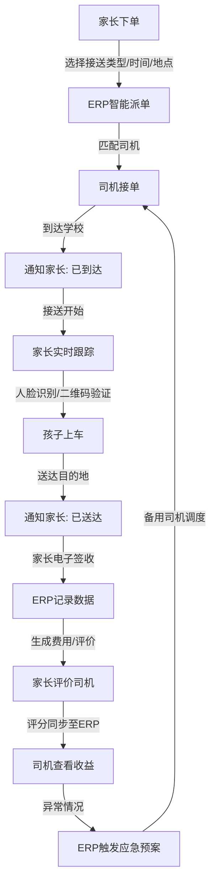

# 儿童接送小程序产品需求文档 (PRD)

**标题**: School Uber 需求分析  
**日期**: 2025-05-22  
**版本**: 1.0  

## 前提条件 企业资质

### 资质相关

| 资质名称                     | 申请周期          | 难易程度     |
|------------------------------|------------------|--------------|
| **营业执照**                 | 5-15个工作日     | ⭐ |  
| **ICP备案**                  | 5个工作日（上海） | ⭐ |  
| **增值电信业务经营许可证**   | 30个工作日       | ⭐⭐⭐⭐ |  
| **网络安全等级保护备案**     | 30个工作日       | ⭐⭐⭐⭐ |  
| **道路运输经营许可证**       | 30个工作日       | ⭐⭐⭐⭐⭐ |  
| **个人信息保护合规**          | 10-20个工作日    | ⭐⭐⭐ |  

车辆运营相关

| 资质名称                 | 申请周期   | 难易程度   |
|--------------------------|-----------|-----------|
| **道路运输经营许可证**   | 30个工作日 | ⭐⭐⭐⭐⭐   |
| **网约车经营许可证**     | 申请难度极高 | ⭐⭐⭐⭐⭐   |

### 价格相关

| 地图服务   | 费用（商用）                   | 主要功能                                    | 优势特点                                    |
|------------|-------------------------------|---------------------------------------------|---------------------------------------------|
| 高德地图   | 5万-10万元/年或30元/万次调用 | 地图展示、定位、路径规划、地理编码、搜索等 | 导航精准，路况实时，行程报告便于报销      |
| 百度地图   | 5万元/年或30-50元/万次调用   | 地图展示、定位、路径规划、地理编码、AR导航 | POI丰富，AI功能强，支持全球地图            |
| 腾讯地图   | 5万元/年或30元/万次调用      | 地图展示、定位、路径规划、地理编码、街景   | 微信小程序整合，界面简洁，街景室内地图强  |

**说明**：
- **商用要求**：公司使用需购买商用授权，否则不可用于商业项目。
- **选择建议**：高德适合导航和报销，百度功能多样，腾讯适合微信生态和简洁体验。
- 具体费用依使用量而定，联系官方确认：
  - 高德：https://lbs.amap.com/
  - 百度：http://lbsyun.baidu.com/
  - 腾讯：https://lbs.qq.com/

### 硬件

https://detail.tmall.com/item.htm?abbucket=5&detail_redpacket_pop=true&id=814783261044&ltk2=174783887766133wpniflo94u334j3zkpd&ns=1&priceTId=2100c80617478388549874120e0967&query=%E6%B1%BD%E8%BD%A6lbs%20%E7%9B%91%E6%8E%A7&skuId=5598881352195&spm=a21n57.1.hoverItem.43&utparam=%7B%22aplus_abtest%22%3A%22ca0f1442349d919a2466618efc39c347%22%7D&xxc=taobaoSearch

## 1. 引言

### 1.1 产品目标
- 为家长提供安全、便捷、可靠的儿童接送服务，解决上下学接送难题，提升生活品质。
- 构建家长、司机、平台三方生态，实现信息透明、服务标准化、管理智能化。

### 1.2 目标用户
- **家长**：忙碌双职工家庭、居住地远离学校的家庭、注重孩子出行安全的家庭。
- **司机**：持合法驾驶资质、希望利用空闲时间增加收入的个体。
- **平台运营方**：欲进入儿童出行市场、建立品牌并实现盈利的企业。

### 1.3 产品范围
- **家长端小程序**：用户管理、订单创建、实时跟踪、费用反馈、会员体系。
- **司机端APP**：司机认证、订单管理、安全沟通、考勤收益、车辆管理。
- **ERP管理后台**：订单调度、司机管理、安全风控、财务管理、数据分析。

### 1.4 术语定义
- **ERP**：企业资源计划（Enterprise Resource Planning）
- **GPS**：全球定位系统（Global Positioning System）
- **PRD**：产品需求文档（Product Requirements Document）
- **UI**：用户界面（User Interface）
- **APP**：应用程序（Application）

## 2. 用户故事

### 2.1 家长端
- 我希望随时预约孩子接送服务，节省时间精力。
- 我希望查看司机信息、实时跟踪车辆、验证孩子安全。
- 我希望灵活设置接送时间地点，支持临时和周期预约。
- 我希望费用透明，支持多种支付方式。
- 我希望评价司机服务，推动平台优化。

### 2.2 司机端
- 我希望便捷接收和管理订单，获取详细任务信息。
- 我希望导航最优路线，实时更新订单状态。
- 我希望快速处理紧急情况，保障孩子和自身安全。
- 我希望清晰查看收入，准确记录工作时长。

### 2.3 ERP管理后台
- 我希望实时监控订单和司机位置，优化派单效率。
- 我希望管理司机档案、培训和绩效，提升服务质量。
- 我希望监控车辆状态，预警并处理风险。
- 我希望自动对账、配置计费规则、管理发票。
- 我希望分析用户和服务数据，支持运营决策。

## 3. 功能需求

### 3.1 家长端小程序
#### 3.1.1 用户管理
- **注册/登录**：支持手机号、邮箱、微信一键登录，短信/邮箱密码找回，实名认证（OCR识别身份证+学籍信息）。
- **孩子档案**：支持多孩子管理，字段包括姓名、学校、年级、接送地址（地图选点）、血型、过敏史、特殊需求（如“需穿防晒衣”）。地理围栏异常提醒。
- **紧急联系人**：最多3位，设置优先级，支持微信/WhatsApp一键呼叫。

#### 3.1.2 接送服务
- **订单创建**：
  - 类型：单程（上学/放学）、往返、临时预约（30分钟内，溢价）。
  - 时间：精确到10分钟，支持周期预约（如每周一至五）。
  - 模板：支持“常规模板”（如工作日接送）。
- **司机匹配**：ERP自动分配附近司机，优先“专属管家”或收藏司机，展示照片、姓名、驾龄、评分、车辆类型、安全座椅情况。
- **实时跟踪**：地图显示车辆位置/ETA，推送通知（如“司机5分钟到达”），支持车内监控预览，应用内聊天（预设消息模板）。
- **安全验证**：双端人脸识别（二维码扫描备用），家长电子签名签收，生成凭证。

#### 3.1.3 费用与反馈
- **透明计费**：显示基础费、附加费（高峰期/长距离），支持动态定价，多种支付方式（微信/支付宝/银行卡）。
- **评价体系**：1-5星评分，文字/照片/视频反馈，支持匿名。

#### 3.1.4 会员体系
- **积分系统**：消费获积分，可兑换接送券、兴趣班券、公益活动（如教育捐助）。
- **专属权益**：固定司机优先、免费取消订单（1次/月）、免费安全座椅。

### 3.2 司机端APP
#### 3.2.1 司机认证
- **认证流程**：上传身份证、驾驶证、无犯罪记录，AI+人工审核，活体人脸检测，生成唯一司机ID。
- **培训**：强制观看安全接送视频（急救/防拐骗），通过互动测验，多语言支持。

#### 3.2.2 订单管理
- **接单模式**：ERP自动派单，支持手动选择高优先级订单，显示时间、地点、孩子姓名、备注。
- **路线规划**：集成高德/百度地图，生成最优路线，实时交通备选路线，显示油耗/时间。
- **状态更新**：支持“已到达”“接送中”“已送达”，自动通知家长。

#### 3.2.3 安全与沟通
- **紧急处理**：一键上报异常（堵车/孩子不适），拨打家长电话，触发ERP应急预案。
- **监控录制**：全程录制视频，加密存储30天，家长可申请查看（需ERP审批）。

#### 3.2.4 考勤与收益
- **收益查看**：实时显示待结/已结金额，收益趋势图（周/月）。
- **在线打卡**：记录工作时长，ERP自动计算薪资。

#### 3.2.5 车辆管理
- 支持多车辆绑定，上传行驶证/保险，自动提醒保养/违章查询。

### 3.3 ERP管理后台
#### 3.3.1 订单与调度
- **智能派单**：按区域、司机偏好、评分、车辆类型分配，动态调整高峰期派单。
- **订单看板**：实时显示订单状态（待接/进行中/完成/异常），支持筛选，异常订单标红预警。

#### 3.3.2 司机管理
- **档案管理**：存储个人信息、培训记录、评分、违规历史，生成行为分析。
- **绩效考核**：准时率、家长评价、安全记录生成1-5星评级，影响派单优先级，月度奖励机制。
- **培训体系**：推送线上安全课程（如极端天气规范），司机需完成考核。

#### 3.3.3 安全与风控
- **监控中心**：实时查看车辆GPS/监控画面，AI检测异常（急刹车/偏离路线），生成风险报告。
- **数据加密**：儿童信息/视频加密存储，符合《个人信息保护法》/GDPR，定期安全审计。
- **应急预案**：预设“车辆故障”“司机突发疾病”方案，一键触发备用司机。

#### 3.3.4 财务管理
- **计费规则**：支持区域差异化定价，动态调整（如节假日优惠），自动对账生成报表。
- **发票管理**：支持电子发票申请/批量导出，集成税务系统。

#### 3.3.5 数据分析
- **用户画像**：统计家长地域、孩子年龄、接送频率，生成热力图（高峰时段/区域）。
- **服务优化**：分析超时/投诉原因，生成改进建议。

## 4. 非功能需求

### 4.1 性能
- 页面加载时间：90%不超过3秒。
- 并发支持：高峰期500用户同时访问。
- 订单处理：派单/状态更新<1秒。

### 4.2 可用性
- 简洁直观UI，符合用户习惯。
- 提供帮助文档，支持iOS/Android/Web。

### 4.3 安全性
- 数据加密存储/传输，防止泄露。
- 严格身份验证，防止SQL注入/XSS攻击。

### 4.4 可靠性
- 系统可用性99.9%，支持数据备份/恢复。
- 7x24小时技术支持。

### 4.5 可维护性
- 模块化代码设计，清晰日志记录。
- 支持快速故障排查和功能升级。

### 4.6 可扩展性
- 支持用户/业务量增长。
- 灵活部署，适配多城市运营。

## 5. 优先级
- **P0（必须）**：
  - 家长端：注册/登录、孩子档案、订单创建、实时跟踪、安全验证、计费。
  - 司机端：认证、接单、状态更新。
  - ERP：派单、订单看板、司机档案、数据加密。
- **P1（重要）**：
  - 家长端：紧急联系人、评价、会员体系。
  - 司机端：路线规划、紧急处理、监控录制、打卡、收益。
  - ERP：绩效考核、监控中心、对账。
- **P2（次要）**：
  - 家长端：监控预览、专属权益。
  - 司机端：车辆管理。
  - ERP：培训、应急预案、发票、数据分析。

## 6. 三端联动逻辑
- **订单流程**：家长下单 → ERP派单 → 司机接单 → 家长跟踪+安全验证 → 家长签收 → ERP结算/记录。
- **数据互通**：评价/评分/状态实时同步，异常数据存档。
- **安全闭环**：人脸识别/监控视频/GPS形成证据链，支持查询（需授权）。

## 7. 产品流程图

## 8.功能模块清单

### 家长端小程序 功能清单

| #   | 阶段/模块                 | 简称                     | 类别     | 功能清单                                                                 |
|-----|--------------------------|--------------------------|----------|-----------------------------------------------------------------------|
| 1   | 登录                       | Parent_Login             | 基础     | 用户登录                                                                 |
| 2   | 注册                       | Parent_Register          | 基础     | 用户注册，实名认证                                                       |
| 3   | 找回密码                   | Parent_PasswordReset     | 基础     | 找回密码（通过手机号/邮箱）                                              |
| 4   | 首页                       | Parent_Home              | 基础     | 展示订单状态、快速下单、轮播图/广告位                                   |
| 5   | 订单创建                   | Parent_OrderCreate       | 主/从   | 创建接送订单                                                               |
| 6   | 司机匹配                   | Parent_DriverMatch       | 主/从   | 查看匹配司机、确认订单                                                     |
| 7   | 实时跟踪                   | Parent_RealTimeTrack     | 功能模块 | 跟踪车辆位置、监控                                                       |
| 8   | 订单完成                   | Parent_OrderComplete     | 主/从   | 确认签收、评价司机                                                       |
| 9   | 孩子档案                   | Parent_ChildProfile      | 基础     | 添加/编辑孩子信息                                                         |
| 10  | 会员中心                   | Parent_MemberCenter      | 功能模块 | 查看积分、兑换权益、会员等级展示                                         |
| 11  | 订单历史                   | Parent_OrderHistory      | 基础查询 | 查看历史订单记录                                                           |
| 12  | 消息中心                   | Parent_MessageCenter     | 功能模块 | 查看系统通知、司机消息                                                     |
| 13  | 设置                       | Parent_Settings          | 基础     | 账号设置、隐私管理、通知开关、常见问题、联系客服、关于我们               |
| 14  | 支付                       | Parent_Payment           | 功能模块 | 在线支付功能、支付方式选择、查看支付记录                                   |
| 15  | 优惠券                     | Parent_Coupon            | 功能模块 | 查看/使用优惠券、领取优惠券                                                |
| 16  | 地址管理                   | Parent_AddressManage     | 基础     | 添加/编辑常用接送地址                                                     |

### 司机端APP 功能清单

| #   | 阶段/模块                 | 简称                     | 类别     | 功能清单                                                                 |
|-----|--------------------------|--------------------------|----------|-----------------------------------------------------------------------|
| 1   | 登录                       | Driver_Login             | 基础     | 司机登录                                                                 |
| 2   | 认证                       | Driver_Auth              | 基础     | 认证资料上传                                                               |
| 3   | 找回密码                   | Driver_PasswordReset     | 基础     | 找回密码（通过手机号）                                                     |
| 4   | 首页                       | Driver_Home              | 基础     | 查看待接订单、快速接单、今日/本月收入概览                                |
| 5   | 路线规划                   | Driver_RoutePlan         | 主/从   | 显示最优路线、导航                                                         |
| 6   | 紧急处理                   | Driver_EmergencyHandle   | 功能模块 | 上报异常情况、一键求助                                                     |
| 7   | 收益管理                   | Driver_RevenueManage     | 基础查询 | 查看收益、考勤、提现申请                                                   |
| 8   | 车辆管理                   | Driver_VehicleManage     | 基础     | 管理车辆信息、车辆状态上报                                                 |
| 9   | 订单历史                   | Driver_OrderHistory      | 基础查询 | 查看历史订单记录                                                           |
| 10  | 消息中心                   | Driver_MessageCenter     | 功能模块 | 查看系统通知、家长消息                                                     |
| 11  | 设置                       | Driver_Settings          | 基础     | 账号设置、通知开关、工作模式、服务协议、隐私政策                           |
| 12  | 个人资料                   | Driver_Profile           | 基础     | 查看/编辑司机个人信息、头像上传                                            |
| 13  | 行程记录                   | Driver_TripLog           | 基础查询 | 记录每次行程的详细日志                                                     |
| 14  | 评价查看                   | Driver_RatingView        | 基础查询 | 查看家长对司机的评价                                                       |
| 15  | 工作日历                   | Driver_WorkCalendar      | 功能模块 | 查看排班、休假安排、申请休假                                               |
| 16  | 违规记录                   | Driver_ViolationRecord   | 基础查询 | 查看违规记录、申诉入口                                                     |
| 17  | 收款码                     | Driver_QRCode            | 功能模块 | 展示收款二维码                                                             |
| 18  | 服务范围                   | Driver_ServiceArea       | 基础     | 设置/查看服务区域                                                           |

### ERP管理后台 功能清单

| #   | 阶段/模块                 | 简称                 | 类别     | 功能清单                                                                 |
|-----|--------------------------|----------------------|----------|-----------------------------------------------------------------------|
| 1   | 登录                       | ERP_Login            | 基础     | 管理员登录                                                                 |
| 2   | 找回密码                   | ERP_PasswordReset    | 基础     | 找回密码（通过邮箱）                                                       |
| 3   | 订单看板                   | ERP_OrderDashboard   | 基础查询 | 实时监控订单状态、订单统计                                                 |
| 4   | 司机管理                   | ERP_DriverManage     | 基础     | 查看/编辑司机档案、绩效、审核司机认证                                      |
| 5   | 监控中心                   | ERP_MonitorCenter    | 功能模块 | 实时查看车辆位置/监控、历史轨迹回放                                        |
| 6   | 财务管理                   | ERP_FinanceManage    | 基础     | 配置计费规则、生成报表、提现审核                                           |
| 7   | 数据分析                   | ERP_DataAnalysis     | 基础查询 | 查看用户画像、服务优化建议、运营数据报表                                   |
| 8   | 用户管理                   | ERP_UserManage       | 基础     | 管理家长/司机账号、用户标签管理                                            |
| 9   | 权限管理                   | ERP_RoleManage       | 基础     | 配置角色权限、操作日志审计                                                 |
| 10  | 日志查看                   | ERP_LogViewer        | 基础查询 | 查看系统操作日志                                                           |
| 11  | 设置                       | ERP_Settings         | 基础     | 系统设置、通知模板配置、支付配置、短信/邮件配置                            |
| 12  | 车辆管理                   | ERP_VehicleManage    | 基础     | 管理车辆信息、车辆状态监控、添加/编辑车辆                                  |
| 13  | 优惠券管理                 | ERP_CouponManage     | 功能模块 | 创建/编辑/发布优惠券、查看优惠券使用情况                                   |
| 14  | 活动管理                   | ERP_ActivityManage   | 功能模块 | 创建/编辑营销活动、活动效果分析                                            |
| 15  | 投诉管理                   | ERP_ComplaintManage  | 功能模块 | 查看/处理用户投诉                                                           |

## 9. 技术细节
- **UI风格**：
  - 家长端：简洁温馨（蓝色/绿色），优化下单-跟踪-签收流程。
  - 司机端：功能优先（高对比度），提升接单-导航-状态更新效率。
  - ERP后台：数据可视化（暗色主题），突出订单监控-异常处理。

- **系统架构**
  - 手机端 IOS+Android- Flutter
  - 小程序 Vue
  - 后端 Ruby on Rails，分布式部署。
  - 物联网通讯，MQTT。可以采取Emqx

- **技术实现**：
  - 地图：高德/百度API实现定位和路径规划。
  - 安全：人脸识别/视频对接阿里云/腾讯云，数据加密。
  - ERP：模块化架构，支持扩展（如校车服务）。
  
- **测试重点**：
  - 家长端：订单创建速度、地图加载稳定性。
  - 司机端：导航准确性、异常上报响应时间。
  - ERP：派单算法效率、异常报警准确性。

## 10. 未来规划
- 拼车接送功能，降低费用、提高收益。
- 拓展兴趣班/校外活动接送。
- 集成智能硬件（如定位手表），提升安全性。
- 提供定制化接送路线、司机选择。